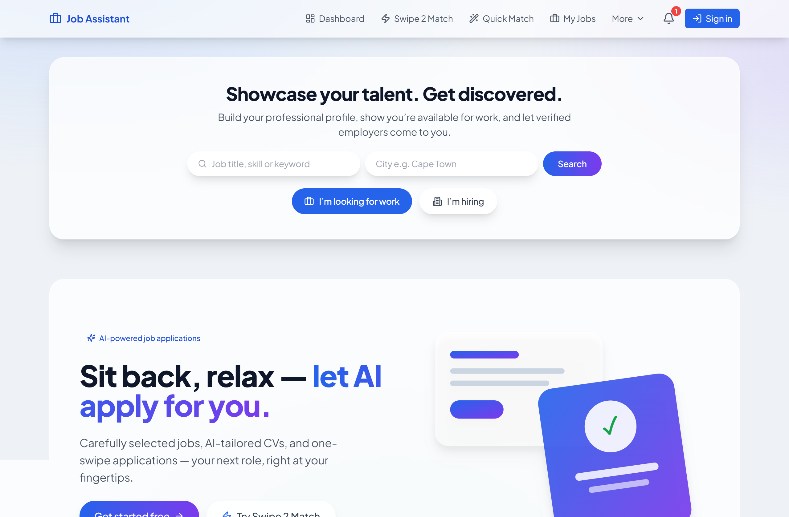
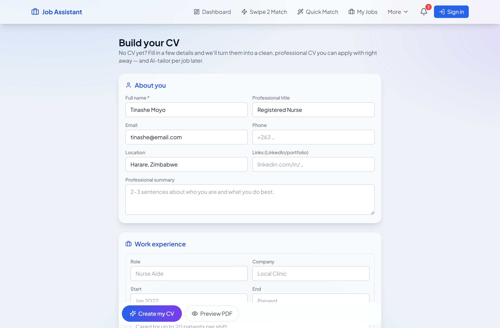
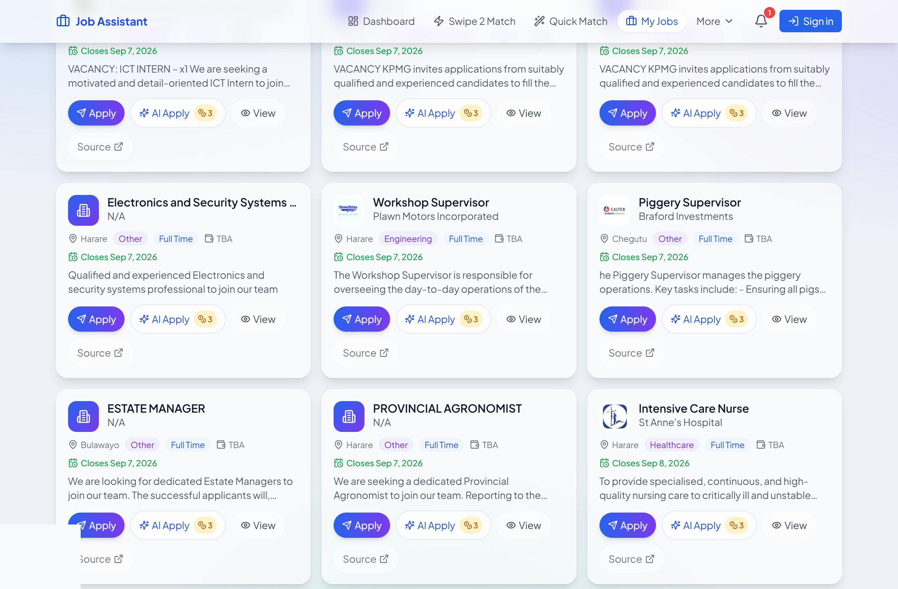
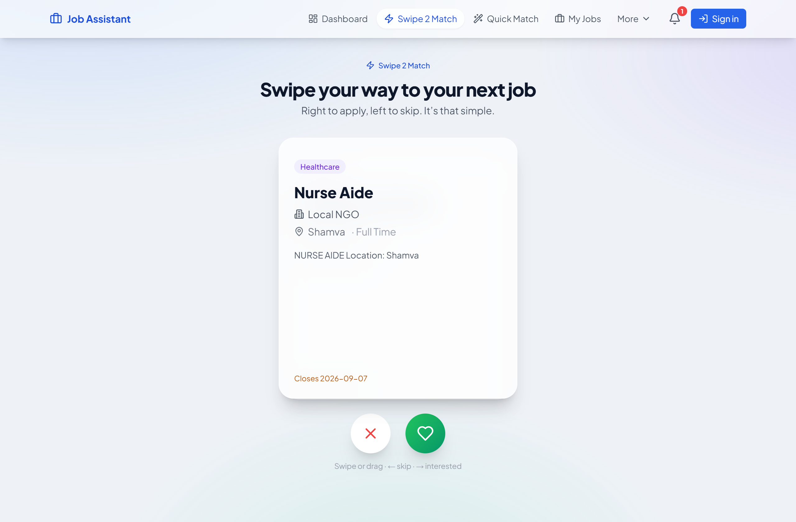
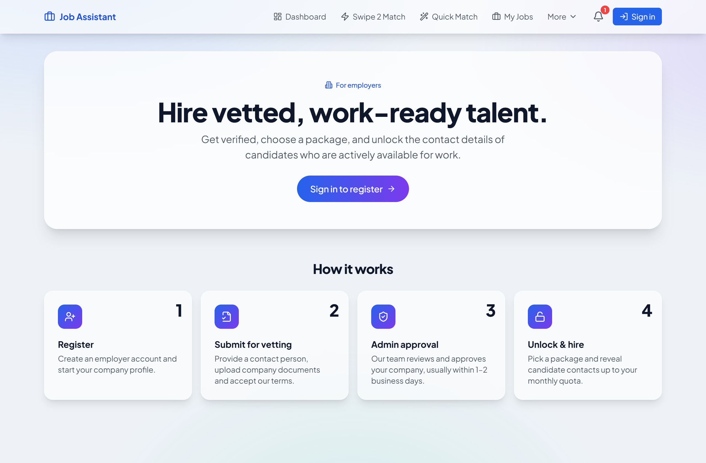

# Job Assistant — How It Works

Job Assistant is a two-sided talent marketplace for Zimbabwe and Southern Africa.
It helps **job seekers** find and apply to jobs with AI-tailored applications, and
helps **employers** discover, vet, and message candidates.

> Screenshots referenced below live in `docs/screenshots/`. See
> [Capturing screenshots](#capturing-the-screenshots) at the end for how to regenerate them.

---

## 1. The job-seeker side (recruitee)

### 1.1 Land and search
The landing page lets a visitor immediately choose their intent — **"I'm looking for
work"** or **"I'm hiring"** — and search by title/skill and city.



### 1.2 Get a CV — upload or build
A candidate needs a CV to apply. There are two paths:

- **Upload** an existing CV (PDF / DOCX / image). It's converted to clean text and
  stored privately against the account. Multiple CVs are supported — rename, edit
  (in a Word-like editor), set a primary, or delete.
- **Build one** from scratch: the guided *CV Builder* asks a few questions (about you,
  work experience, education, skills) and produces a clean, professional PDF CV. This
  is the answer for first-time job seekers who have no CV at all.



### 1.3 Browse jobs
Jobs are aggregated from Zimbabwean job boards, de-duplicated, and enriched (company
logo, sector, salary, deadline, apply email). Candidates can filter by sector, location,
type, and source. Each card offers two clearly-separated actions:

- **Apply** — free. Opens the send screen with the candidate's own CV.
- **AI Apply** (3 credits, shown with a coin badge) — the AI tailors the CV and cover
  note to that specific job before sending.



### 1.4 Swipe 2 Match
A Tinder-style deck lets candidates swipe right/left on jobs. Guests get a few free
swipes before signing in. Liked jobs collect into a shortlist they can apply to.



### 1.5 Jobs Near Me
A radar view surfaces jobs by city (with optional geolocation), showing full titles and
a detail view with a "Source" link back to the original posting.

### 1.6 Apply
The apply screen sends the application from the candidate's **own Gmail** (OAuth), so it
lands in the employer's inbox from the real person, not a shared address. The candidate
chooses:

- **My original CV** — attaches the uploaded file exactly as-is (with a picker when they
  have several CVs), or
- **AI-tailored** — an editable, job-specific version exported to PDF or Word.

A short success chime plays when the email sends. Applications are tracked (sent /
responded), and can be "unsent" from tracking.

### 1.7 Profile, verification & credits
Candidates can publish a profile (availability, headline, sector, skills) to be
discoverable by employers, and order **background checks** (identity, education,
employment, criminal) that show as verified badges. AI actions are metered with credits;
new accounts start with a free balance and can top up.

---

## 2. The employer side (recruiter)

### 2.1 Register and get approved
Employers register a company (with a verification document) and are approved by an admin
before they can unlock contacts — this keeps the candidate pool protected.



### 2.2 Browse candidates by sector
Approved employers browse candidate cards grouped by sector, with headline, experience,
skills, and any **verified** badges.


### 2.3 Swipe to shortlist
An employer swipe deck lets recruiters shortlist candidates quickly. Shortlisted
candidates are saved for follow-up.

### 2.4 Unlock & message
Revealing a candidate's contact details costs credits (this is a core revenue event).
Once unlocked, the employer can message the candidate in-app; threads are two-way.

### 2.5 Admin & announcements
Admins approve/reject employers, manage other admins, review background-check orders, and
post product **announcements** that surface in the in-app notification bell for everyone.

---

## 3. Under the hood (one-paragraph architecture)

A **Next.js** frontend (Vercel) talks to a **Cloudflare Worker** API backed by a KV store.
AI runs on **Cloudflare Workers AI** (Llama 3.3) with an OpenAI fallback, behind a
provider-agnostic layer. Auth is Google (NextAuth); the Gmail access token stays
server-side so applications send from the user's own mailbox. Payments are Stripe Checkout
(credit packs), with mobile-money (Paynow/EcoCash) planned for the local market.

---

## Capturing the screenshots

The images above are placeholders so the document renders even before screenshots exist.
To (re)generate them, run the frontend locally and capture each page at ~1280px wide:

```
cd packages/frontend && npm run dev   # http://localhost:3100
```

Save PNGs into `docs/screenshots/` with these names:

| File | Page | Notes |
|------|------|-------|
| `landing.png` | `/` | Signed out |
| `cv-builder.png` | `/cv-builder` | A few fields filled |
| `jobs.png` | `/jobs` | Show the Apply / AI Apply buttons |
| `swipe-2-match.png` | `/smart-match` | The swipe deck |
| `employers.png` | `/employers` | Employer landing |
| `candidates.png` | `/employers/candidates` | Signed in as an approved employer |

Pages that require a signed-in candidate (dashboard, apply modal) or an approved employer
(candidates, messaging) need a logged-in session to capture.
